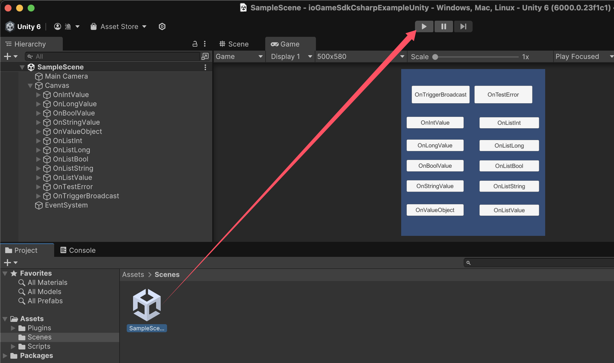
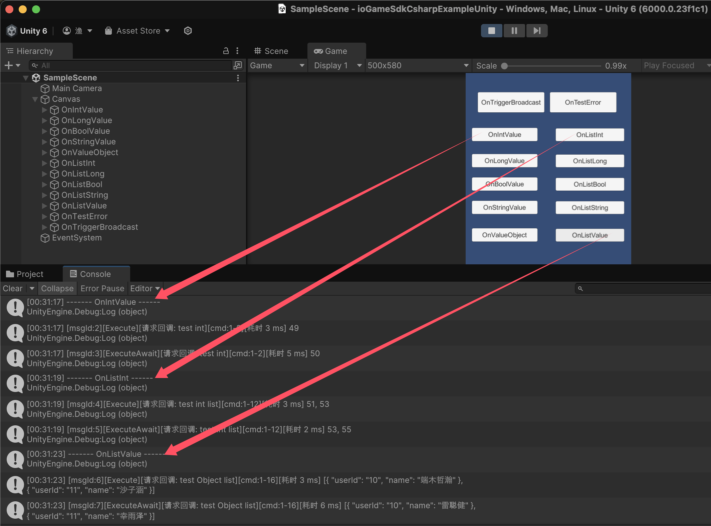

[中文](./README_CN.md)

## ioGameSdkCsharpExampleUnity

The [ioGame C# SDK](https://github.com/iohao/ioGame/issues/205) provides a simple wrapper for interaction between the Netty, WebSocket, Protobuf, C#, and [ioGame](https://github.com/iohao/ioGame/) game servers.

The files such as `action, broadcast, error codes`, etc., in the `./Assets/Scripts/Gen/Code` directory are generated by ioGame. [Code generation](https://github.com/iohao/ioGame/issues/328) can significantly reduce the workload for client developers.

[C# SDK](https://github.com/iohao/ioGame/issues/205) + [Code Generation](https://github.com/iohao/ioGame/issues/328) = a variety of advantages

Advantages of SDK Code Generation

1. Helps client-side developers reduce significant workload by eliminating the need to write a large amount of template code.
2. Clear and semantically precise. The generated interaction code clearly defines parameter types and return types.
3. Ensures parameter type safety and clarity in interface methods, effectively avoiding security risks and reducing basic errors during integration.
4. Reduces communication costs between the server and client during integration; the code serves as documentation. The generated integration code includes documentation and usage examples, and the examples on the methods will guide you on how to use them, making it zero-learning-cost even for beginners.
5. Helps client-side developers abstract away the interaction with the server, allowing them to focus more on the core business logic.
6. Reduces the cognitive load during integration. The code is simple to use, similar to local method calls.
7. Abandons the traditional protocol-based approach in favor of an interface-method-based integration approach.

## Quick Start

### Start the ioGame game server

see https://github.com/iohao/ioGameExamples/SdkExample

### Start Unity

> Unity Version: 6000.x

​	

### Home

## How to generate .proto code

> see compile-proto.sh
>
> https://github.com/protocolbuffers/protobuf/releases

## Finally

Remember, you don't need to write any interaction files (`actions, broadcasts, error codes`). These are generated by the ioGame server. You only need to focus on the actual business logic.

